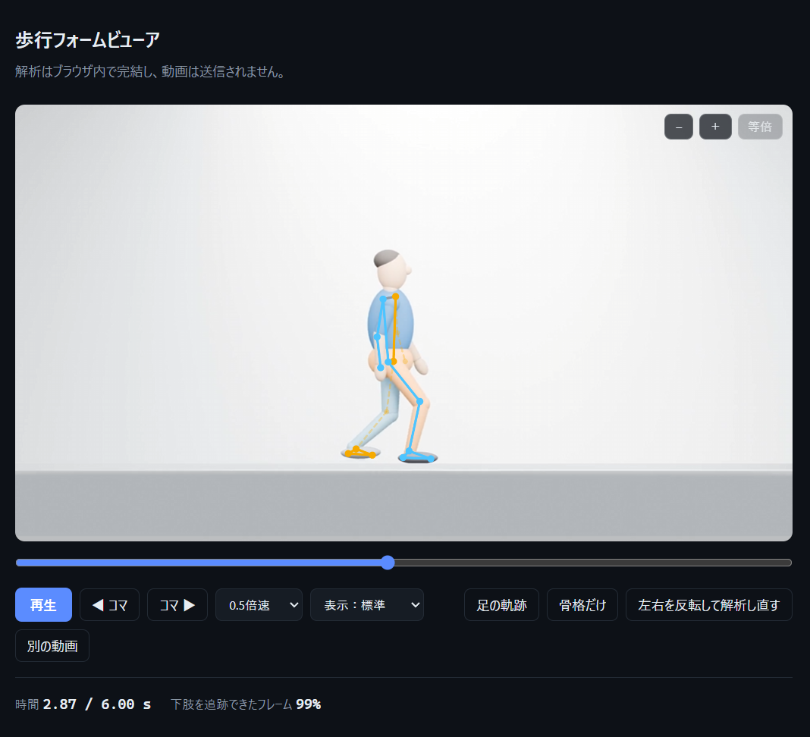

# 歩行フォームビューア

歩行動画に骨格を重ね、コマ送りで確認するためのブラウザツールです。姿勢推定はブラウザ内で実行され、選択した動画は外部に送信されません。初回の利用時には、姿勢推定プログラムとモデルを外部サーバーから読み込みます。

[歩行フォームビューアをブラウザで開く](https://norio111.github.io/gait_viewer/)

## 作った動機

**理学療法士として。** 歩行観察を補助できるか試すために作りました。動画を撮って見返す運用は珍しくありませんが、細かく止めて見るには市販の動画プレーヤーでは操作が粗いと感じていました。

**機械学習の学習として。** 既製の姿勢推定モデル（MediaPipe Pose Landmarker）の出力を、どこまで信用できるか確かめる目的もあります。モデルを動かすことより、返ってきた出力のうち何が使えて、何が使えないかを切り分けることに重心を置きました。

この2つは別の目的です。臨床課題を解決する完成品ではなく、モデルの得意・不得意を見分けながら使う試作です。

## できること

- 歩行動画への骨格の重畳表示
- コマ送り（1/24秒単位）と0.25〜1倍速の再生
- 足部の軌跡表示（確信度の低い区間は途切れる）
- 確信度の低い部位の薄い破線表示
- 骨格のみ表示（顔や背景を隠して第三者に見せる）
- 停止したコマの拡大・移動（最大6倍。ピンチ／ホイール／ボタン）
- 全画面表示
- 左右反転（鏡像で記録された映像の補正）
- 下肢を追跡できたフレームの割合の表示

## 出さないもの、とその理由

関節角度、歩幅、歩行速度、左右対称性などの数値は表示しません。初期版では膝・股関節の角度、ケイデンス、歩幅、可動域なども実装していました。しかし単眼映像から算出した値について、三次元動作解析装置などとの妥当性検証を行っておらず、精度を示せません。

「膝屈曲62°」のような具体的な値を表示すると、検証されていなくても記録や判断に使われる可能性があります。不正確な数値が確かな測定値と同じように扱われることを避け、このツールはフォームを目で確認する用途に限定しています。

表示する「下肢を追跡できたフレーム」の割合も、解析精度ではなく撮影状態を確認するための目安です。判定に使う `visibility` はモデルの推定値であり、正解ではありません。70%を下回ると表示色が変わります。

## 左右の向きと鏡像

骨格の色分け（左＝オレンジ、右＝青）は**対象者から見た左右**です。対象者がカメラを向いている映像では、対象者の左脚は画面右側に表示されます。

臨床歩行分析では左側を暖色、右側を別の色で示す慣習があり、右側には緑がよく使われてきました。ただし赤と緑は赤緑色覚異常で最も見分けにくい組み合わせのため、右側を青に置き換える方が望ましいとされています。ここでもその考え方に従っています。

インカメラなどで鏡像保存された映像は、見た目だけでは判別できません。自動判定は行わず、利用者が「左右を反転して解析し直す」を選ぶ仕様にしています。反転は表示だけでなく、推論前の動画フレームに適用します。

色だけで左右を決めず、映像と骨格を見比べて確認してください。

## 開発中に踏んだ問題

### 1. 再解析すると処理が停止する

左右反転後の再解析が途中で止まる原因は、MediaPipe の `detectForVideo()` が単調増加するタイムスタンプを要求することでした。2回目の解析で動画時刻が0秒に戻ると、前回より小さい値が渡されて例外になります。

そこで、モデル用のタイムスタンプを動画時刻から分離し、解析をまたいで増加するカウンターに変更しました。また、例外を画面に表示し、失敗時にボタンが無効のまま残らないようにしています。

### 2. 側面撮影の追跡率が15%になる

同じ被写体でも、正面は92%、側面は15%になりました。側面では手前の脚が描画されていたため、撮影ではなく判定条件の問題でした。

当初は、左右の股関節・膝・足首の6点すべてで `visibility` が閾値を超えたフレームだけを数えていました。しかし側面では、奥側の脚が手前の脚に隠れるのが自然です。「正常な遮蔽」と「撮影失敗」を区別できていませんでした。

現在は、左右どちらか一方の脚が股関節から足首まで追跡できれば成立と判定します。奥側の推定が不安定でも数値には表れないため、確信度の低い骨は薄い破線、関節点は薄く小さく描画し、足部軌跡も低確信度の区間では途切れさせています。左右別の割合は、入口の指標を複雑にしないため表示していません。

### 3. 縦向き動画が画面に収まらない

iPhoneの縦動画（9:16）が画面高を超えたため、表示領域の高さに上限を設け、縦横比から幅を算出するようにしました。

### 4. 日本語が不自然な位置で折り返す

`max-width: 60ch` は半角文字を基準にするため、日本語では想定より短い位置で折り返します。説明文を文単位の `inline-block` にして、改行位置を文の区切りに限定しました。

### 5. Windowsで日本語だけ別のフォントになる

Mac向けのヒラギノしか指定していなかったため、Windowsでは日本語だけブラウザ既定のフォントに落ちていました。`"Yu Gothic UI", "Yu Gothic", Meiryo` を追加し、OSによる表示差を抑えています。

## 技術構成

- MediaPipe Tasks Vision（Pose Landmarker, full モデル）
- CDNから依存を読み込む、ビルド不要のHTML 1ファイル
- 読み込み時に一度だけ解析してランドマークを保存
- 再生・コマ送り・拡大操作ではモデルを再実行しない
- 動画フレームをオフスクリーンcanvasに描画し、表示と同じ向きで推論
- 姿勢推定・描画・UI制御をそれぞれ独立した層に分離
- Mac・Windows双方の日本語フォントをフォールバックに指定

## 動作確認

以下の環境・動画で基本操作を確認しています。

- Windows 10／Microsoft Edge
- Blender 4.1で作成した合成歩行動画
  - MP4（H.264）
  - 1920×1080、30fps、6秒
  - 正面および側面からの歩行
- iPhoneの背面カメラで撮影した縦向き動画

確認した操作：

- 骨格の重畳表示
- 再生、停止、コマ送り
- 拡大、移動
- 足部軌跡と骨格のみ表示
- 左右反転後の再解析
- 正面・側面動画での追跡率表示

ほかのOS、ブラウザ、長時間動画での動作は未確認です。

## 使い方

1. ブラウザで再生可能な mp4 / mov / webm形式の動画を選ぶ
2. 自動解析の完了を待つ
3. 再生・コマ送りでフォームを確認する
4. 必要に応じて足部軌跡、骨格のみ表示、拡大を使う
5. 骨格の左右が実際の脚と逆なら「左右を反転して解析し直す」を選ぶ

## 利用条件と限界

- 1人の全身が映っている動画を前提としています
- 複数人が映る場合も、検出するのは1人だけです
- 人物の見切れや大きな遮蔽がある動画には適しません
- 解析時間は動画の長さと端末性能に左右されます
- 臨床での診断や定量評価を目的としたツールではありません

<!-- 実際に試した端末・ブラウザ・動画条件をここに追記 -->

## 制作の経緯

同じ題材で作るのは2回目です。初回は2年前で、完成までに数日かかりました。今回は実装時間が短くなった一方、実際の動画を正面・側面の両方から試し、モデルの出力と画面上の見え方が一致しているかを確かめる工程に時間を使いました。
